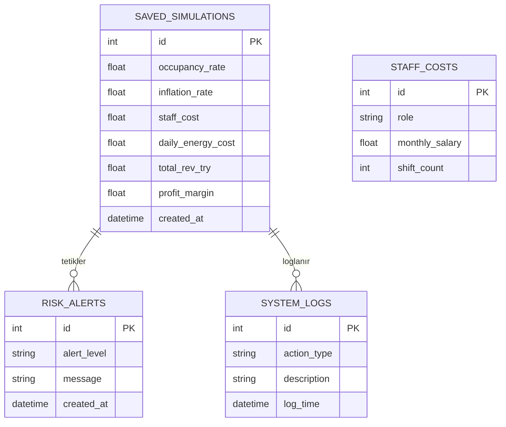

# Otel Karar Destek Sistemi (KDS)

## 📖 Proje Açıklaması
Bu proje, **Otel Yönetimi** için geliştirilmiş web tabanlı bir Karar Destek Sistemidir (KDS). Amaç, otel yöneticilerinin doluluk oranları, mevsimsel etkiler, personel maliyetleri ve ekonomik faktörleri (enflasyon, döviz) göz önüne alarak **en karlı oda satış fiyatını** belirlemelerine yardımcı olmaktır.

Sistem, geçmiş verileri ve kullanıcı tarafından girilen simülasyon parametrelerini işleyerek **dinamik kar/zarar analizi** sunar ve stratejik karar alma süreçlerini destekler.

Proje, **MVC (Model-View-Controller)** mimarisine sadık kalınarak, **RESTful API** prensiplerine uygun şekilde geliştirilmiştir.

---

## 🎯 Senaryo Tanımı
**"Global View Hotel"**, 100 odalı butik bir şehir otelidir. Otel yönetimi, değişen piyasa koşullarında (yakıt zamları, asgari ücret artışları, turizm sezonu dalgalanmaları) sabit oda fiyatı politikası uygulamanın kar marjını düşürdüğünü fark etmiştir.

**Problem:**
- Kış sezonunda doluluk düşmesine rağmen sabit personel giderleri karlılığı eritmektedir.
- Yaz sezonunda talep artmasına rağmen yanlış fiyatlandırma potansiyel gelir kaybına yol açmaktadır.

**Çözüm:**
Bu KDS yazılımı ile yönetici:
1.  Farklı doluluk senaryoları (%50, %80, %100) oluşturabilir.
2.  Döviz kuru ve enflasyon beklentilerini sisteme girerek geleceğe yönelik simülasyon yapabilir.
3.  Sistem, girilen parametrelere göre **"Önerilen Minimum Satış Fiyatı"** hesaplar.

---

## ⚙️ Kurulum Adımları

Bu projeyi bilgisayarınızda çalıştırmak için aşağıdaki adımları izleyin.

### Gereksinimler
- Node.js (v14 ve üzeri)
- MySQL Veritabanı

### Kurulum

1.  **Projeyi Klonlayın:**
    ```bash
    git clone https://github.com/AliAKBULAK/kds_projesi_.git
    cd kds_projesi_
    ```

2.  **Bağımlılıkları Yükleyin:**
    ```bash
    npm install
    ```

3.  **Çevresel Değişkenleri Ayarlayın (.env):**
    `.env.example` dosyasının adını `.env` olarak değiştirin ve veritabanı bilgilerinizi girin:
    ```ini
    PORT=3000
    DB_HOST=localhost
    DB_USER=root
    DB_PASSWORD=
    DB_NAME=kds_db
    ```

4.  **Veritabanını Kurun:**
    *(MySQL servisinizin çalıştığından emin olun)*
    ```bash
    node database/setup_db.js
    ```

5.  **Uygulamayı Başlatın:**
    ```bash
    npm run dev
    ```

6.  **Tarayıcıda Açın:**
    Adres: `http://localhost:3000`

---

## 🔌 API Endpoint Listesi

Sistem aşağıdaki RESTful API uç noktalarını sunar:

| Metot | Endpoint | Açıklama |
| :--- | :--- | :--- |
| `GET` | `/api/dashboard/stats` | Ana gösterge paneli özet verilerini getirir. |
| `GET` | `/api/currency/rates` | Güncel döviz kurlarını getirir (USD/EUR/GBP). |
| `POST` | `/api/simulation/calculate` | Girilen parametrelere göre simülasyon hesaplar. |
| `POST` | `/api/simulation/save` | Oluşturulan simülasyonu veritabanına kaydeder. |
| `GET` | `/api/simulation/history` | Geçmiş simülasyon kayıtlarını listeler. |
| `GET` | `/api/staff/costs` | Güncel personel ve vardiya maliyetlerini getirir. |

---

## 📊 ER Diyagramı (Veritabanı Şeması)

Aşağıda projenin veritabanı yapısı (Entity-Relationship Diagram) yer almaktadır:



## 🏗️ Mimari Yapı (MVC)
- **Model:** `models/` klasöründe veritabanı işlemleri (SQL sorguları).
- **View:** `public/` klasöründe HTML/CSS/JS dosyaları.
- **Controller:** `controllers/` klasöründe iş mantığı ve request/response yönetimi.
- **Route:** `routes/` klasöründe URL yönlendirmeleri.
